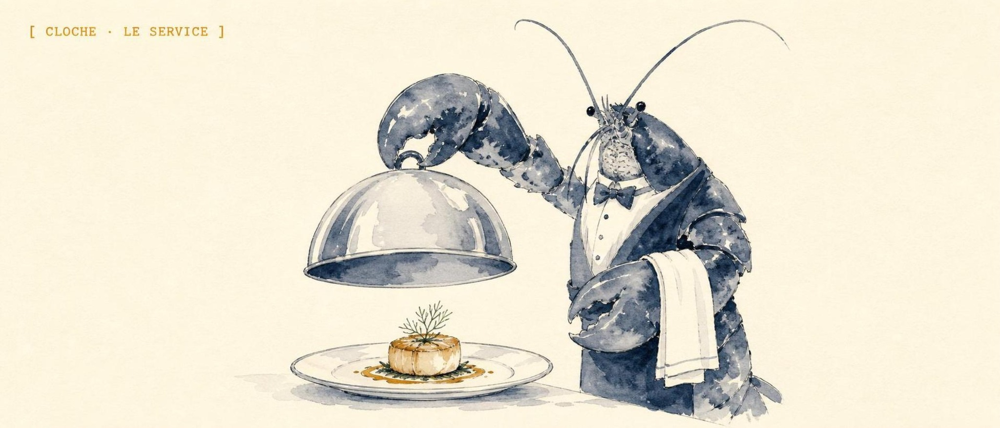
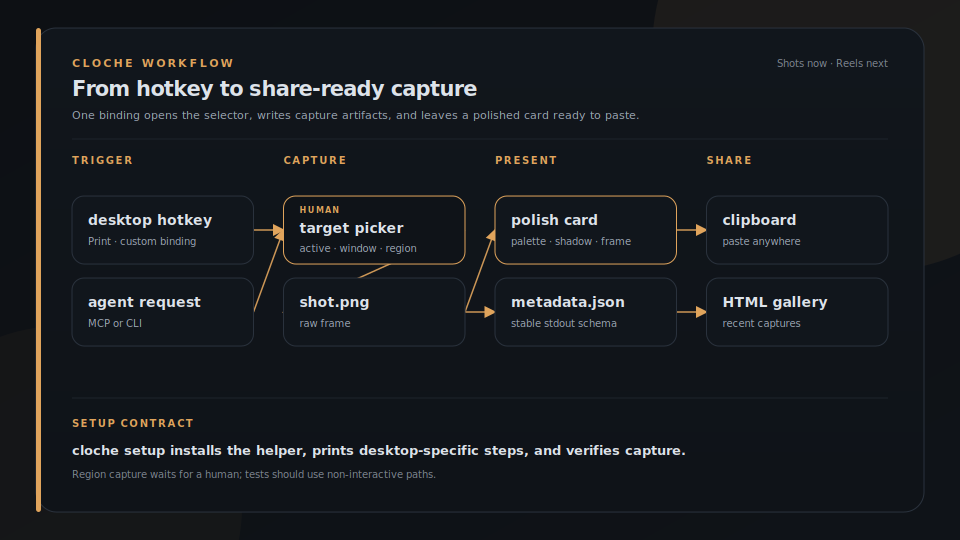

<p align="center">
  
</p>

<h1 align="center">Cloche</h1>

<p align="center">
  
</p>

<p align="center">
  <strong>Lift the dome. Present the shot.</strong>
</p>

<p align="center">
  Agent-neutral desktop capture: polished share-ready frames, stable JSON on stdout, optional MCP. For READMEs, hotkeys, and coding agents.
</p>

<p align="center">
  <a href="https://brigade.tools/cloche">Website</a> &middot; <a href="#install">Install</a>
</p>

<p align="center">
  
  
</p>

## Install

```bash
cargo install cloche
# or from git
cargo install --git https://github.com/escoffier-labs/cloche
```

## What it does

| | Job | What you get |
|---|---|---|
| **Capture** | Any window or region | Desktop frames without a browser extension stack |
| **Present** | Polished share cards | README- and social-ready framing, not a raw dump |
| **Emit** | Stable JSON stdout | Shells, hotkeys, and agents can consume the result |
| **Serve** | Optional MCP | Expose capture to coding agents when you want it |


## Quick Start

Capture the active app or window as a Shot:

```bash
cloche capture --target active --out-dir /tmp/cloche-shot-$(date +%s) --format json
```

Style an existing screenshot into a presentation card without recapturing:

```bash
cloche polish /tmp/diff.png --palette violet-haze --format json
```

Render an existing short recording through the experimental Remotion reel engine:

```bash
cd remotion && npm install && cd ..
cloche reels render \
  --input raw.mp4 \
  --out demo.mp4 \
  --cues cues.json \
  --title "Create a project"
```

The cue file follows the AppReels timeline shape:

```json
{
  "titleCard": { "text": "Create a project", "ms": 900 },
  "captions": [{ "startMs": 1000, "endMs": 2600, "text": "Open the project menu" }],
  "zooms": [{ "startMs": 1200, "endMs": 2400, "scale": 1.35, "x": 0.3, "y": 0.4 }],
  "outroCard": { "text": "Done", "ms": 700 }
}
```

Zooms ease in and out on their own; `x`/`y` (0 to 1 across the footage,
optional) pick the focus point, defaulting to center.

Preview the latest capture:

```bash
cloche preview
```

Create a self-contained HTML gallery of recent Shots:

```bash
cloche gallery --root /tmp --html /tmp/cloche.html --title "My Shots" --open
```

Generate a Codex `turn/start` payload from a Shot:

```bash
cloche codex-payload --thread-id "$THREAD_ID" /tmp/cloche-shot-123
```

## Command Reference

```bash
cloche doctor --format json
cloche list-windows --format json
cloche capture --target active --presentation both --out-dir /tmp/cloche-shot --format json
cloche capture --target active --style-seed 12345 --out-dir /tmp/cloche-shot --format json
cloche capture --target screen --out-dir /tmp/cloche-shot --format json
cloche capture --target window --title Firefox --out-dir /tmp/cloche-shot --format json
cloche capture --target region --presentation both --clipboard --out-dir /tmp/cloche-shot --format json
cloche polish /tmp/diff.png --format json
cloche polish /tmp/diff.png --out /tmp/diff-card.png --palette ember-glow --style-seed 12345
cloche gallery --limit 10
cloche gallery --root /tmp --html /tmp/cloche.html --title "My Shots" --open
cloche latest
cloche preview
cloche open /tmp/cloche-shot
cloche schema
cloche schema --for polish
cloche codex-payload --thread-id THREAD_ID /tmp/cloche-shot
cloche mcp
cloche setup
cloche setup --print
cloche setup hotkey
cloche setup agent --client claude-code
cloche setup verify --format json
```

The old `appshots` command remains as an alias for the same code path.

## Modes

**Shots** are available now. A Shot is a still capture with raw and presentation images, metadata, and optional extracted text.

**Reels** are planned next. A Reel will be a short desktop recording with the same Cloche presentation system, cursor emphasis, captions, and stable metadata. The existing Appreels prototype is the starting point for this mode.

**GIF export** is planned after Reels. GIFs will be generated from finished Reels as a delivery format, not recorded as the primary source format.

## Why Cloche Exists

OpenAI documents Appshots as a macOS app feature for Codex. The Codex repository can already resume threads that contain local images through app-server v2 `turn/start` input:

```json
{ "type": "localImage", "path": "/absolute/path/to/shot.png", "detail": "high" }
```

Linux and Windows users still need a reliable way to create those captures from a normal CLI. Cloche fills that capture side while staying independent of any one agent stack. Use it with Codex, OpenClaw, Claude Code, Hermes, a local MCP client, or a plain shell script.

Reference: <https://developers.openai.com/codex/appshots>

## Output Files

Each successful Shot directory contains:

- `shot.png`, the raw captured image.
- `shot-card.png`, a presentation image: the screenshot with rounded corners and a soft shadow on a full-bleed gradient backdrop, fully opaque so it survives JPEG and pasting anywhere.
- `metadata.json`, the same JSON object printed to stdout.
- `text.txt`, optional best-effort accessible text from the focused app.

Capture exits with `0` only when a raw image was written. Text extraction and presentation-image failures are warnings because accessibility support and desktop compositing vary by toolkit, app, desktop environment, and OS. `--target screen` exists as a fallback and debugging mode. `--target active` is the default.

Use `--presentation raw`, `--presentation card`, or `--presentation both` to control output image generation. Use `--style-seed <number>` to reproduce a randomized card style exactly.

`--target region` opens an interactive selector (Flameshot when available, ImageMagick `import` drag-select on X11): drag a rectangle and the shot is taken the moment you release. Add `--clipboard` to copy the finished card straight to the clipboard (wl-copy on Wayland, xclip on X11). Region capture needs a human at the desk; it is not for headless agents. Not yet supported on Windows: use Win+Shift+S, save the file, then `cloche polish <file>`.

## Hotkey Workflow

Bind one key to get a share-ready card on your clipboard: press it, drag a
region, paste the polished card anywhere. The capture, polish, and clipboard
copy all happen in cloche; only the key binding is set up per desktop.



Generated from [`docs/assets/workflows/hotkey.json`](docs/assets/workflows/hotkey.json) with `plating workflow`.

The fastest path is one command:

```bash
cloche setup
```

It installs `cloche-grab`, binds it to Print on GNOME (and prints the exact
steps on KDE/sway/i3), registers the MCP server with any agent it detects, then
verifies that capture, the hotkey, and the MCP server actually work. Run
`cloche setup --print` to preview every change first, or `cloche setup verify`
any time to re-check. The manual steps below are what `cloche setup` automates,
and the fallback for unsupported desktops.

The repo ships `scripts/cloche-grab.sh`, which wraps the capture and adds a
desktop notification. Install it and bind it:

```bash
# 1. Put the script on your PATH (or point the binding at it in place).
install -Dm755 scripts/cloche-grab.sh ~/.local/bin/cloche-grab

# 2. Confirm it works (it opens the region selector):
cloche-grab
```

Then bind `cloche-grab` to a key:

- **GNOME:** Settings -> Keyboard -> View and Customize Shortcuts -> Custom
  Shortcuts -> +. Name it "Cloche Grab", command `cloche-grab`, and set the
  shortcut (e.g. Print). To move the native screenshot UI off Print first:
  `gsettings set org.gnome.shell.keybindings show-screenshot-ui "['<Shift>Print']"`.
- **KDE:** System Settings -> Shortcuts -> Custom Shortcuts -> Edit -> New ->
  Global Shortcut -> Command/URL, command `cloche-grab`, then assign a key.
- **Anything else (sway, i3, ...):** bind a key to `cloche-grab` in your WM
  config.

Prefer no script? Bind this one-liner directly instead:

```bash
cloche capture --target region --presentation both --clipboard --out-dir ~/Pictures/ClocheShots/$(date +%s)
```

`cloche polish` writes a single card PNG instead of a Shot directory:
`<input>-card.png` next to the input by default, or the `--out <path>` you
pass (it must end in `.png`). Its stdout JSON reports `input`, `card`, and
`presentationStyle`.

## Agent Use

Any shell-capable agent can call:

```bash
cloche capture --target active --out-dir /tmp/cloche-shot-$(date +%s) --format json
```

Then parse `image.path` from stdout or read the generated `metadata.json`.

Codex app-server clients can turn a capture into a ready `turn/start` payload:

```bash
cloche codex-payload --thread-id "$THREAD_ID" /tmp/cloche-shot-123
```

Other agents should treat Cloche as a normal subprocess tool. The core command has no MCP dependency, desktop-app dependency, or agent-specific runtime dependency.

## MCP Server

`cloche mcp` runs a minimal stdio MCP server for clients that prefer the Model Context Protocol over direct subprocess calls. It speaks newline-delimited JSON-RPC 2.0 on stdin/stdout and exposes `capture`, `polish`, `list_windows`, `doctor`, `latest`, and `gallery` as tools. Each tool call shells out to the same binary, so the JSON contract is identical to the CLI.

`cloche setup agent` registers this server with Claude Code, OpenClaw, and Codex CLI automatically (backing up any config it edits, and skipping clients already configured). The manual config below is for other clients or if you prefer to wire it yourself.

Register it like any stdio MCP server:

```json
{
  "mcpServers": {
    "cloche": { "command": "cloche", "args": ["mcp"] }
  }
}
```

Compatibility config:

```json
{
  "mcpServers": {
    "appshots": { "command": "appshots", "args": ["mcp"] }
  }
}
```

## Linux Backend Notes

- X11 active/window capture uses `xdotool`/`wmctrl` for window metadata and ImageMagick `import` for PNG capture.
- Wayland wlroots screen capture uses `grim`.
- GNOME/KDE Wayland may block silent active-window capture by design. Use `--target screen` or run `cloche doctor --format json` for diagnostics.
- Text extraction is best-effort through AT-SPI using Python GI when available.

If you are invoking Cloche from SSH, a TTY, or an agent process that did not inherit the desktop environment, Cloche will try to discover the live desktop variables from desktop processes. On GNOME X11 they usually look like:

```bash
export DISPLAY=:1
export XAUTHORITY=/run/user/$(id -u)/gdm/Xauthority
export DBUS_SESSION_BUS_ADDRESS=unix:path=/run/user/$(id -u)/bus
export XDG_SESSION_TYPE=x11
```

You can discover the active values from a desktop process:

```bash
tr '\0' '\n' </proc/$(pgrep -u "$(id -u)" -n gnome-shell)/environ | grep -E '^(DISPLAY|XAUTHORITY|DBUS_SESSION_BUS_ADDRESS|XDG_SESSION_TYPE)='
```

## Windows Backend Notes

- Active/window capture uses Win32 foreground-window and top-level-window metadata, then captures the target window with `PrintWindow` so covered windows are not polluted by whatever is on top. It falls back to `.NET CopyFromScreen` if `PrintWindow` is unavailable for that window.
- Screen capture uses the Windows virtual screen.
- Text extraction is best-effort through UI Automation.
- Capture must run in a logged-in interactive desktop session. Plain OpenSSH sessions can build and run `doctor`, but Windows blocks screen capture from the non-interactive SSH service session.

## Gallery HTML Export

`cloche gallery --html <path>` writes a single self-contained HTML file with each capture's image embedded inline, so the result can be shared without any companion files. Combine with `--root`, `--limit`, `--title`, and `--open`. The JSON output gains an `htmlPath` field pointing at the written file.

## Release Packaging

Build a local release archive:

```bash
bash scripts/package-release.sh
```

On Windows:

```powershell
powershell -ExecutionPolicy Bypass -File scripts/package-release.ps1
```

Archives are written under `dist/`. Tagged GitHub releases are packaged by `.github/workflows/release.yml` for Linux and Windows.

## Why not other screenshot tools?

- **Flameshot, Spectacle, GNOME Screenshot, Greenshot, ShareX** are excellent interactive GUI tools, built for a human clicking and annotating. They do not present a stable command surface for scripts, they do not emit machine-readable JSON, and they do not run headless from an agent process. Cloche is CLI-first and JSON-first; it uses tools like Flameshot for the region-select step but owns the polish, metadata, and contract.
- **`grim` / `scrot` / ImageMagick `import` / `maim`** capture pixels and stop there. You still hand-roll the framing, the gradient, the metadata, and the JSON. Cloche wraps the same low-level capture and does the rest in one command.
- **`carbon-now`, `silicon`, `ray.so`** make beautiful cards out of source code or arbitrary images, not live windows. Cloche captures the actual app and then frames it, and `cloche polish <image>` covers the "I already have a screenshot" case.
- **The macOS Appshots app for Codex** is the inspiration, but it is macOS-only and tied to one agent stack. Cloche fills the same capture role on Linux and Windows while staying agent-neutral: use it with Codex, OpenClaw, Claude Code, Hermes, any MCP client, or a plain shell script.

## What Cloche is not

Cloche is a local capture tool, not a service or an annotation suite.

It does not:

- run a background daemon, tray app, or scheduler
- upload, sync, or phone home with your captures
- annotate, blur, or redact (it frames what is on screen; review before you share)
- record audio or do OCR (text extraction is best-effort via the OS accessibility layer only)
- replace your editor or your sharing host; it writes local files and a JSON receipt, and you take it from there

## Roadmap

See [ROADMAP.md](ROADMAP.md).
